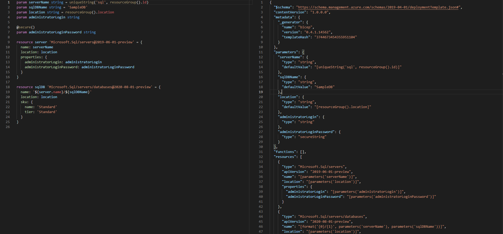
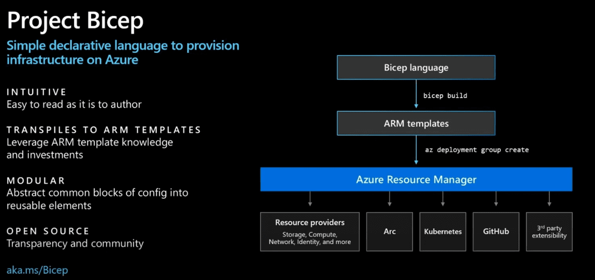
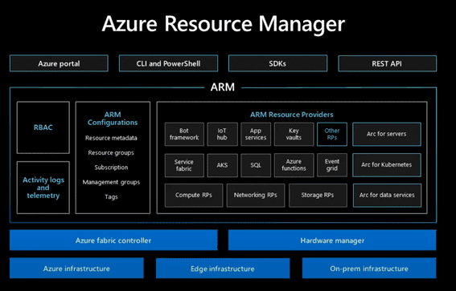
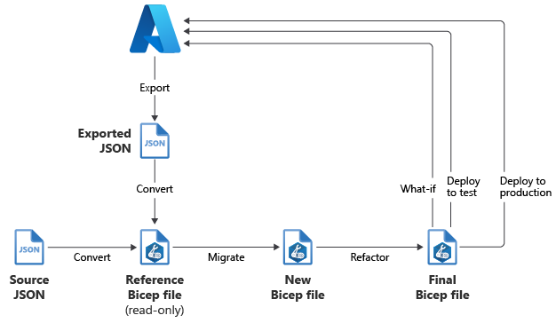

<!--
theme: default
headingDivider: 2 
paginate: false
-->

<!--
_class:
 - lead
-->

# Arrancando curso 2021-2022 con fuerza: Bicep! 💪
<!-- _footer: Raúl Piracés (Software Engineer @ Plain Concepts) -->

<style scoped>
footer {
  font-size: x-large;
}
</style>


## ¿Qué es Azure Bicep?

Es un proyecto de Microsoft
Se trata de un DSL para desplegar recursos de Azure de forma declarativa

**Su finalidad**: simplificar drasticamente la creación de soluciones de IaC en Azure y proveer una abstracción transparente sobre ARM y plantillas ARM.

## Principales ventajas de Bicep

- Soporte para todos los tipos de recursos y versiones de API **de manera inmediata**
- **Sintaxis mucho más simple**... sobre todo comparando con plantillas ARM
- Tipado, IntelliSense y validación de sintaxis (con VS Code)
- Modularidad
- Integración con servicios de Azure (policies, template specs, blueprints)
- **No tenemos que manejar el estado**, Azure lo hará por nosotros

## Comparando Bicep y plantillas ARM
<!--
_backgroundColor: #1e1e1e
_color: white
-->


## Visión general
<!--
_backgroundColor: black
_color: white
-->
<style scoped>
img[alt~="center"] {
  display: block;
  margin: 0 auto;
}
</style>


## Azure Resource Manager (ARM)
<!--
_backgroundColor: black
_color: white
-->
<style scoped>
img[alt~="center"] {
  display: block;
  margin: 0 auto;
}
</style>


## ¿Por qué ahora? 

- Se consideró crear Bicep como **una "revisión" a el lenguaje de las plantillas ARM existentes** (por su audiencia objetivo)

- Bicep tiene como audiencia objetivo aquellos **que aún no han adoptado soluciones de IaC o tienen plantillas ARM en uso**

- Cada uno que use las herramientas y lenguajes que más le gusten

## ¿Que pasa con otras ofertas de IaC?

Terraform, Pulumi y otras soluciones de IaC **seguirán estando ahí y no hay necesidad de cambiar a Bicep**. 

Microsoft y la comunidad se encargarán de que funcionen sobre Azure lo mejor que puedan.

## ¿Que pasa ahora con las plantillas ARM?

Siguen y seguirán funcionando como siempre. **No hay necesidad de hacer cambios**

**Se continua el soporte del lenguaje de las plantillas ARM**

Al fin y al cabo, **Bicep compila a estas plantillas ARM en JSON** y este es enviado a Azure para su despliegue

## Empezando con Bicep...

Dos escenarios:
- Partimos desde plantillas ARM que estamos usando
- Partimos de cero

## Estoy usando plantillas ARM... ¿como paso a Bicep?

<style scoped>
img[alt~="center"] {
  display: block;
  margin: 0 auto;
}
</style>



## Estoy usando plantillas ARM... ¿como paso a Bicep?

Con AZ CLI:
```bash
az bicep decompile --file main.json
```
Si tenemos la CLI instalada:
```bash
bicep decompile --file main.json
```

## Desde cero...

Bastante simple empezar con Bicep, solo necesitaremos [Azure CLI](https://docs.microsoft.com/en-us/cli/azure/install-azure-cli#install) y, opcionalmente, [CLI de Bicep](https://docs.microsoft.com/en-us/azure/azure-resource-manager/bicep/install#install-manually) y la [extensión de VS Code](https://marketplace.visualstudio.com/items?itemName=ms-azuretools.vscode-bicep)

Este tooling nos ayudará bastante con la creación/modificación de ficheros Bicep

Tutoriales en [Microsoft Learn](https://docs.microsoft.com/en-us/azure/azure-resource-manager/bicep/learn-bicep) y ["Bicep Playground"](https://aka.ms/bicepdemo) para empezar a probar sin necesidad de instalar nada

## Más recursos

### Para CI/CD

- [Bicep GitHub Action](https://github.com/marketplace/actions/bicep-build)
- [Bicep Tasks extension for Azure Pipelines](https://marketplace.visualstudio.com/items?itemName=piraces.bicep-tasks)

### Otros:

- [Bicep Language Service support in Neovim](https://github.com/Azure/bicep/issues/1141#issuecomment-749372637)
- [Bicep PowerShell Module](https://github.com/PSBicep/PSBicep)

# Veamos un poco como funciona

# ¡Gracias por asistir! 😀

### Recursos: [bit.ly/bicep_demo](https://bit.ly/bicep_demo)
### Presentación: [bit.ly/ppt-bicep](https://bit.ly/ppt-bicep)
<!--
_class:
 - lead

-->
